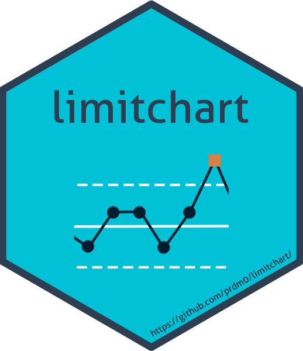

# limitchart R package

In this project, the objective is to create an [R](https://www.r-project.org) library (the **limitchart** library) to help with the problem of monitoring doubly limited data such as rates and proportions, in the area of statistical quality control. When the data do not come from continuous numbers, the $p$ plot becomes inadequate to model these variables.

**Library authors**

- Pedro Rafael D. Marinho: pedro.rafael.marinho@gmail.com;
- Luiz Medeiros de A. L. Filho: luiz@de.ufpb.br;
- Letícia G. C. da Costa.
